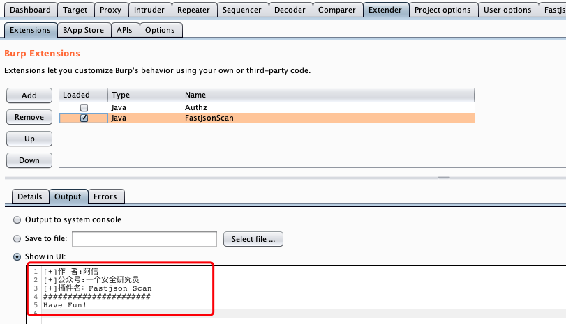
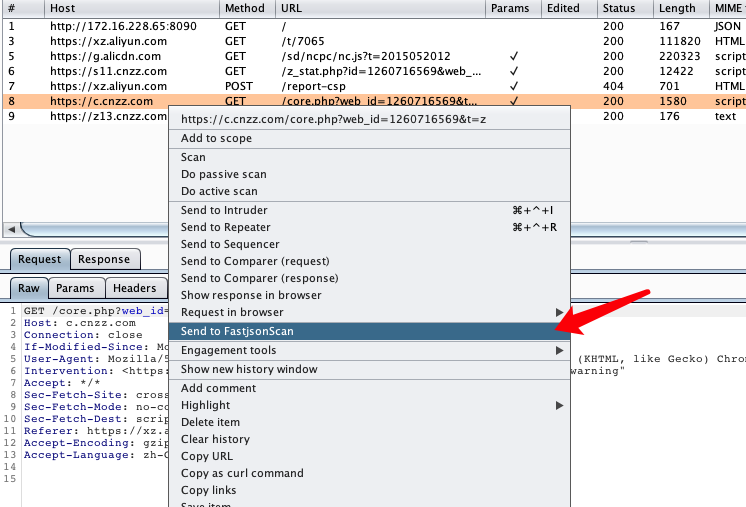
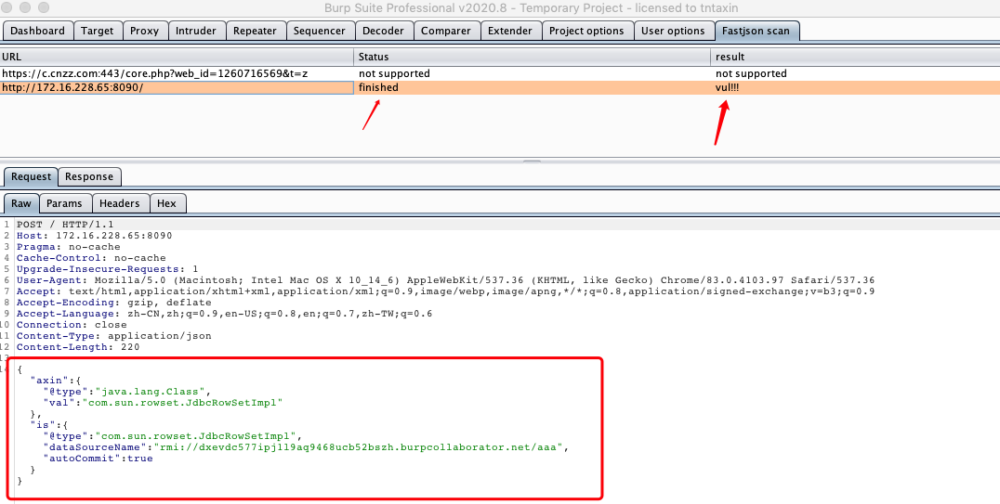

# FastjsonScan

一个简单的Fastjson反序列化检测burp插件

我在挖洞的时候看到一些json请求总是想要检测一下有没有Fastjson反序列化问题，本可以直接写一个脚本来跑或者搭配其他被动扫描器来验证，但是我太懒了，先不说burp搭配其他扫描器了，就连找到特定目录下的脚本我都觉得麻烦，所以，我决定一劳永逸地解决这个问题，于是去学习了一下burp插件的写法糊弄出了这个插件

### 安装方法

- 下载项目中的FastjsonScan.jar文件
- 在burp的Extender->Extensions栏，点击Add,选择下载好的jar文件就可以了（执行环境是Java)
  
如果成功安装，会输出如下信息，如果未能成功安装可以换下jdk版本？？我用的1.8

### 使用方法

使用方法也很简单，就像使用repeater一样，你可以在burp的任何地方选中一个请求右键选择【Send to FastjsonScan】将这个请求发送到Fastjson Scan，然后就只需要等待扫描结束🌶 

右键菜单中：

FastjsonScan扫描结果界面：

如果扫描的目标存在漏洞，在窗口下面的Request窗口会展示使用的payload,如果没有漏洞，则会展示原始的请求与响应

> ps: 由于反序列化检测利用了dnslog，所以检测会稍微慢一点，在等待结果期间你还可以继续看其他请求，真的是相当方便呢

### 核心代码

核心代码都在BurpExtender.java中了，检测逻辑很简单，注释也都写了，如果你有其他的需求，完全可以自己修改，直接在IDEA中打开FastjsonScan目录就可以继续创造了